# Manual de usuario

Este manual contiene una guía de uso de la aplicación D'Hont Analyzer.

# Pantalla de inicio de la aplicación

Al abrir la aplicación se muestra la siguiente pantalla, pulse en el botón con etiqueta `Start!` para empezar a usar la aplicación.

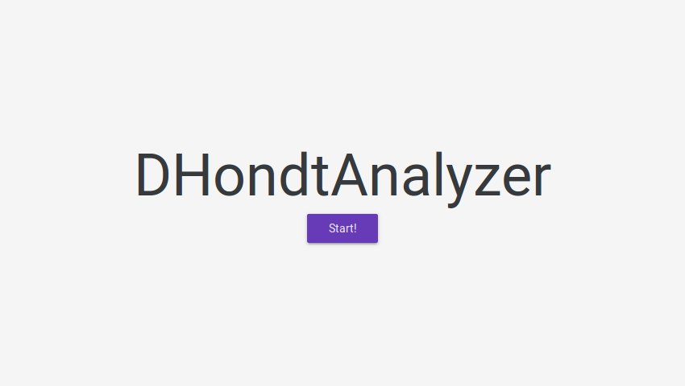

Tras pulsar, se mostrará la aplicación, con el menú superior para navegar entre las distintas pestañas.

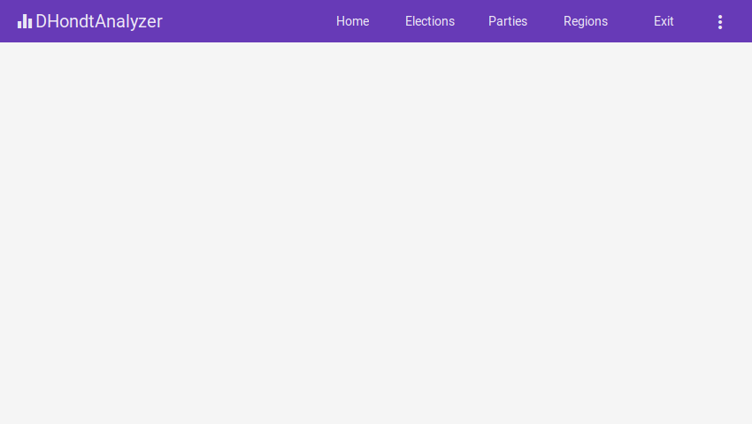

Desde la pestaña `Elections` el usuario puede realizar las siguientes acciones:

* Añadir los datos de unas elecciones en la aplicación.
* Visualizar la información de unas elecciones ya existentes en la aplicación.

Desde la pestaña `Parties` el usuario puede realizar las siguientes acciones:

* Añadir los datos de un nuevo partido dentro de la aplicación.
* Visualizar la información de los partidos registrados en la aplicación.

Desde la pestaña `Regions` el usuario puede realizar las siguientes acciones:

* Añadir los datos de una nueva región en la aplicación.
* Visualizar la información de las regiones de la aplicación.

# Pestaña Elections

Tras pulsar sobre la opción `Elections` en el menú superior, se mostrará la siguiente pantalla:

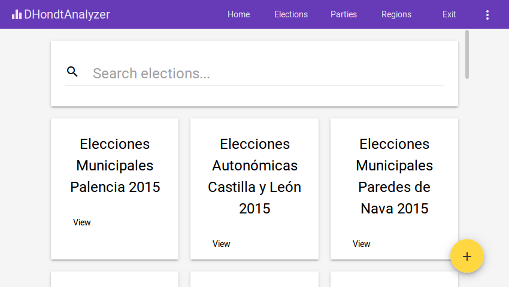

### Buscar una elección

Utilice el formulario del panel superior que contiene una lupa para filtrar las elecciones existentes en la plataforma por nombre, como puede ver en la siguiente imagen:

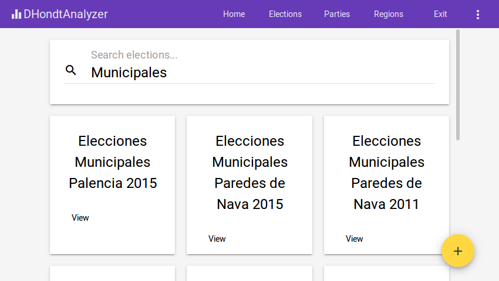

### Crear una nueva elección

Presione sobre el botón con el signo `+` situado en la esquina inferior derecha de la pantalla. Se le abrirá la siguiente ventana.

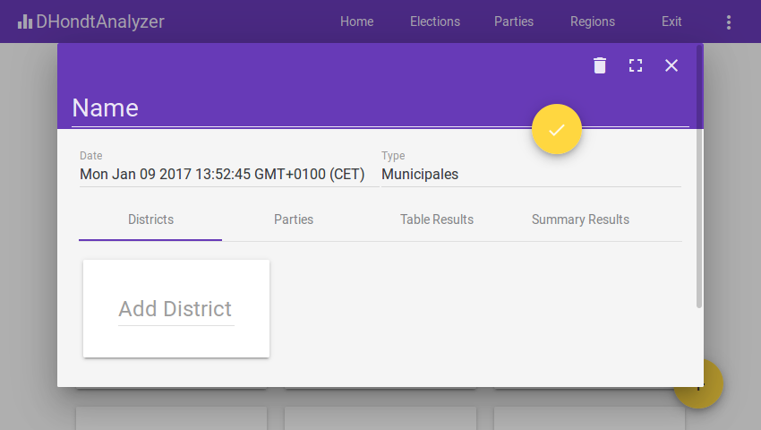

En la esquina superior derecha de la ventana hay dos botones. El botón con forma de cuadrado le permite ampliar la ventana para que ocupe toda la pantalla, mientras que con la cruz cerrará la ventana.

Puede cambiar el nombre con el que los usuarios verán las elecciones que está creando, así como la fecha y el tipo de la elección en el apartado superior.

Añada circunscripciones desde la pestaña `Districts`, que es la que se abre por defecto. Para ello sitúese sobre el cajón de texto `Add District` e introduzca el nombre de la región, que previamente fue incluida en la plataforma, como se muestra en la siguiente imagen:

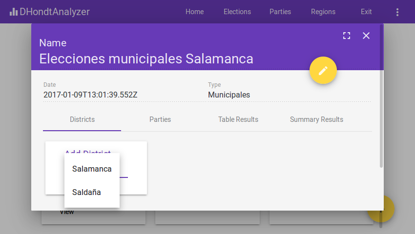

Por último, para cada circunscricpción especifique el número de escaños que se repartirán y el censo de dicha circunscripción, para terminar pulsando el botón `Save` que confirma que los datos son correctos.

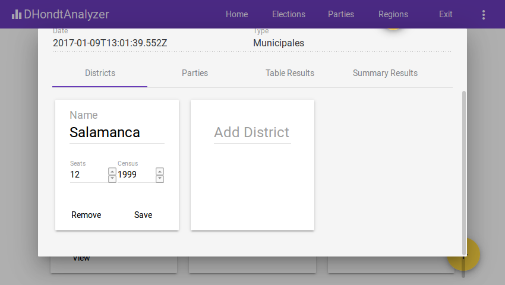

Para incluir los partidos que participan en la elección, pulse sobre la pestaña `Parties`. En dicha pestaña puede modificar y ver el listado de  partidos políticos que participaron en las elecciones.

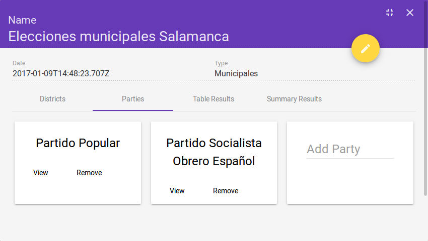

### Introducir información del escrutinio

Cuando tenga una elección seleccionada, pulse en el botón `Table Results` para dirigirse a la pestaña de visualización del escrutinio:

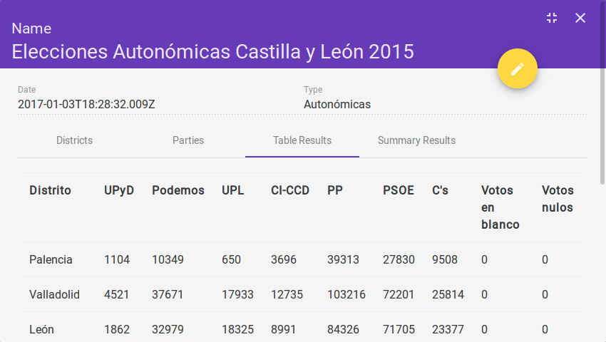

Para modificar alguno de los datos, pulse sobre la celda que quiera modificar con el ratón, y a continuación dispondrá de un campo de texto para introducir el dato del voto.

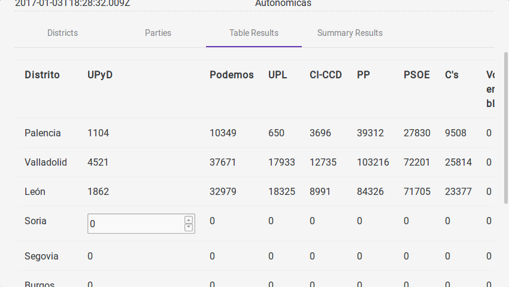

### Modificar las condiciones de reparto

Los escaños se reparten según la Ley D'Hondt especificada en la Ley electoral actual.

# Pestaña Parties

Tras pulsar la opción `Parties` en el menú superior, será dirigido a la siguiente pantalla:

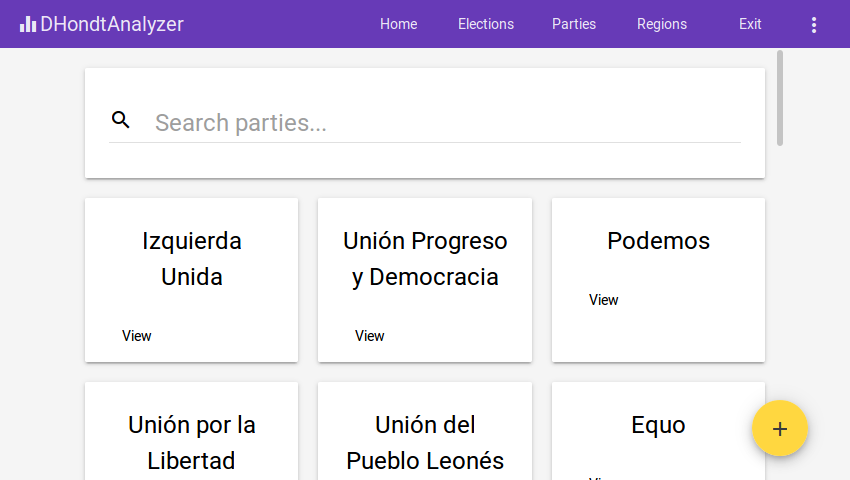

En la parte superior hay un campo de texto para filtrar los partidos existentes por nombre. El conjunto de partidos registrados en la aplicación está en la parte inferior de la pantalla.

### Añadir un partido

Antes de poder ubicar un partido como participante dentro de unas elecciones, es necesario que esté registrado en la aplicación. Para ello, dentro de la pestaña `Parties` pulse en el botón inferior derecho etiquetado con un `+`.

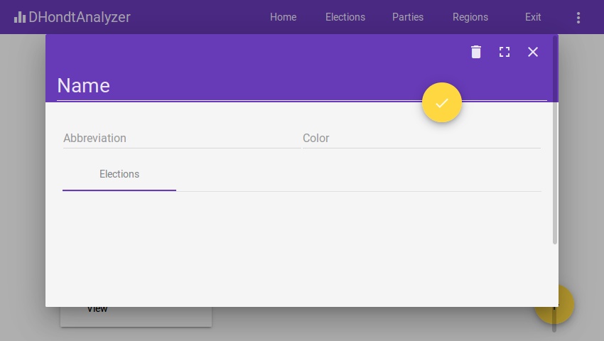

La información que ha de introducir es el nombre del partido, su abreviatura y el color del partido. Una vez haya terminado, pulse el botón amarillo con el tick para guardar el partido.

### Visualizar información de un partido

Pulsando sobre el botón `View` en cualquiera de los partidos de la pestaña `Parties` podrá ver las elecciones en las que participó el partido.

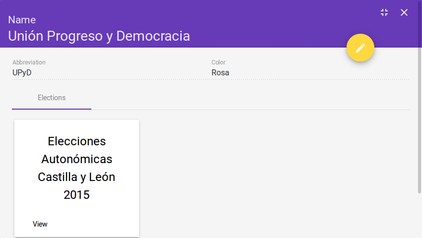

También se encuentra a la vista la abreviatura y el color del partido. Usted puede editar esta información presionando el botón amarillo de la esquina superior derecha con el icono del lápiz.

# Pestaña Regions

En la pestaña `Regions` ha de añadir cada una de las circunscripciones donde se votó en una o más elecciones. El aspecto inicial de la aplicación es el siguiente:

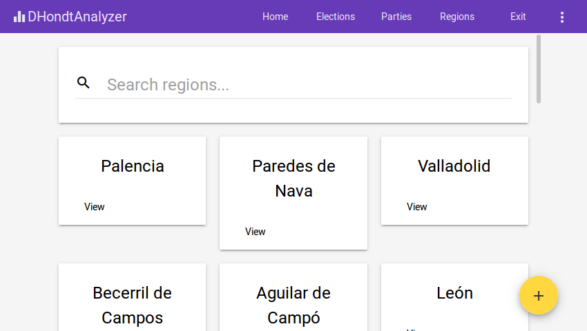

### Añadir una circunscripción

Es necesario que las circunscripciones sean previamente añadidas para poder ser utilizadas en las elecciones. Para ello, pulse el botón inferior derecho con la etiqueta de `+`.

A continuación se le abrirá una ventana donde únicamente ha de introducir el nombre de la circunscripción.

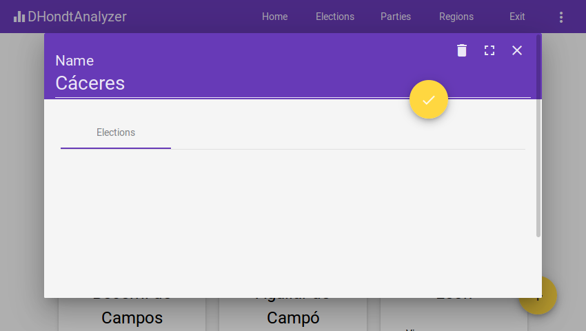

Pulse el botón amarillo redondo de la esquina superior derecha para almacenar la circunscripción en la plataforma.

### Visualizar información de una circunscripción

Pulsando sobre el botón `View` en una circunscripción puede ver las elecciones en las que dicha circunscripción estuvo involucrada, como puede ver en la siguiente imagen.

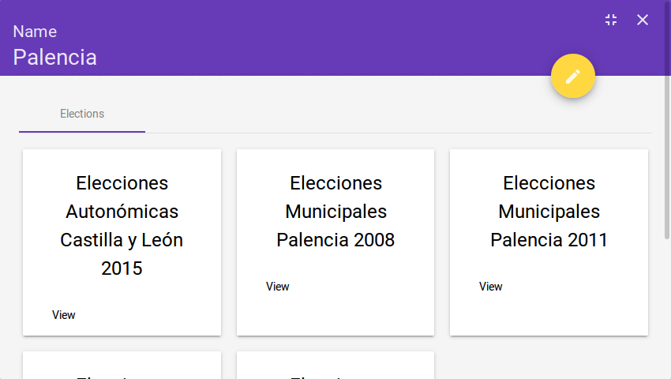

Si pulsa sobre el botón `View` en cualquier elección, será redirigido a la información de dicha elección. Asimismo puede editar el nombre de la circunscripción pulsando sobre el botón `lápiz` situado en la esquina superior derecha.

