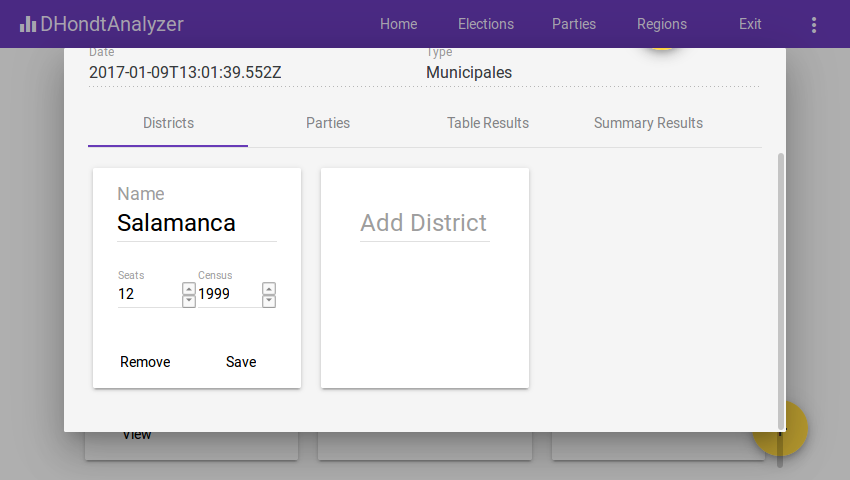

# ATENCION
Capturas de pantalla extraídas con firefox (herramientas de desarrollador con una resolucion 850x480 que otorga una resolucion de aspecto 16:9)
# Manual de usuario

Este manual contiene una guía de uso de la aplicación D'Hont Analyzer.

# Pantalla de inicio de la aplicación

Al abrir la aplicación se muestra la siguiente pantalla, pulse en el botón con etiqueta `Start!` para empezar a usar la aplicación.

Tras pulsar, se mostrará la aplicación, con el menú superior para navegar entre las distintas pestañas.

Desde la pestaña `Elections` el usuario puede realizar las siguientes acciones:

- Añadir los datos de unas elecciones en la aplicación.
- Visualizar la información de unas elecciones ya existentes en la aplicación.

Desde la pestaña `Parties` el usuario puede realizar las siguientes acciones:

- Añadir los datos de un nuevo partido dentro de la aplicación.
- Visualizar la información de los partidos registrados en la aplicación.

Desde la pestaña `Regions` el usuario puede realizar las siguientes acciones:

- Añadir los datos de una nueva región en la aplicación.
- Visualizar la información de las regiones de la aplicación.

# Pestaña Elections

Tras pulsar la pestaña Elections en el menú superior, se mostrará la siguiente pantalla:

### Buscar una elección

Utilice el formulario del panel superior que contiene una lupa para filtrar las elecciones existentes en la plataforma por nombre, como puede ver en la siguiente imagen:

### Crear una nueva elección

Presione sobre el botón con el signo `+` situado en la esquina inferior derecha de la pantalla. Se le abrirá la siguiente ventana.

Puede cambiar el nombre con el que los usuarios pueden buscar las elecciones dentro de la aplicación, la fecha y el tipo de la elección en el apartado superior.

En el caso de elecciones generales, puede añadir circunscripciones desde la pestaña `Districts`, que es la que se abre por defecto. Para ello sitúese sobre el cajón de texto `Add District` e introduzca el nombre de la región, que previamente fue incluida en la plataforma, como se muestra en la siguiente imagen:

Por último, para cada circunscricpción especifique el número de escaños que se repartirán y el censo de dicha circunscripción, para terminar pulsando el botón `Save` que confirma que los datos son correctos.

### Añadir información sobre unas nuevas elecciones

En la parte superior de la pantalla, pulse sobre la pestaña Elecciones, para dirigirse al apartado de elecciones. Una vez allí, pulse sobre el botón con símbolo de + para añadir la información de una nueva elección.

Para crear una nueva elección será necesaria la introducción de la siguiente información:

- Nombre de las elecciones
- Fecha en la que tuvo o tendrán lugar.
- Tipo de elección, actualmente pueden ser nacionales, autonómicas, regionales o europeas.

## Añadir un nuevo partido político en la plataforma.

